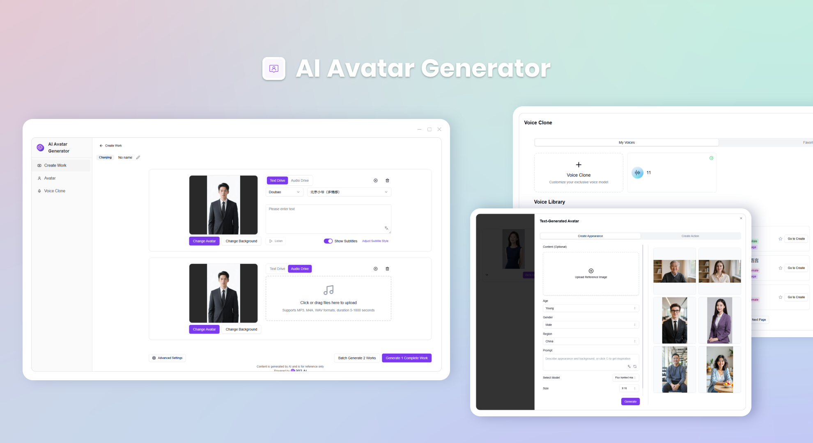
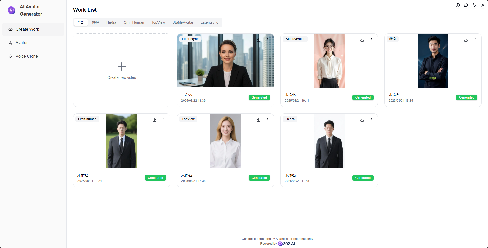
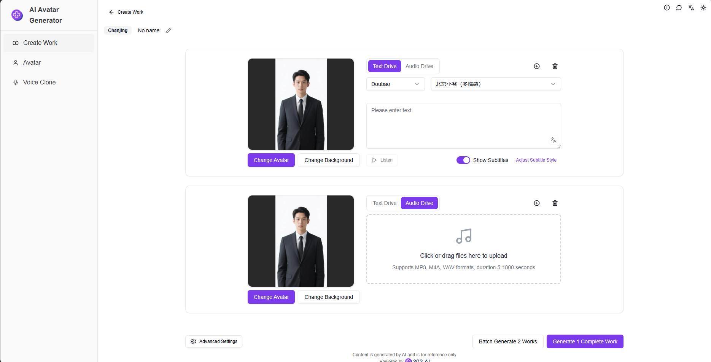
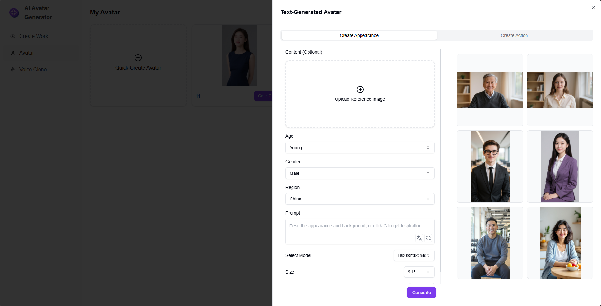
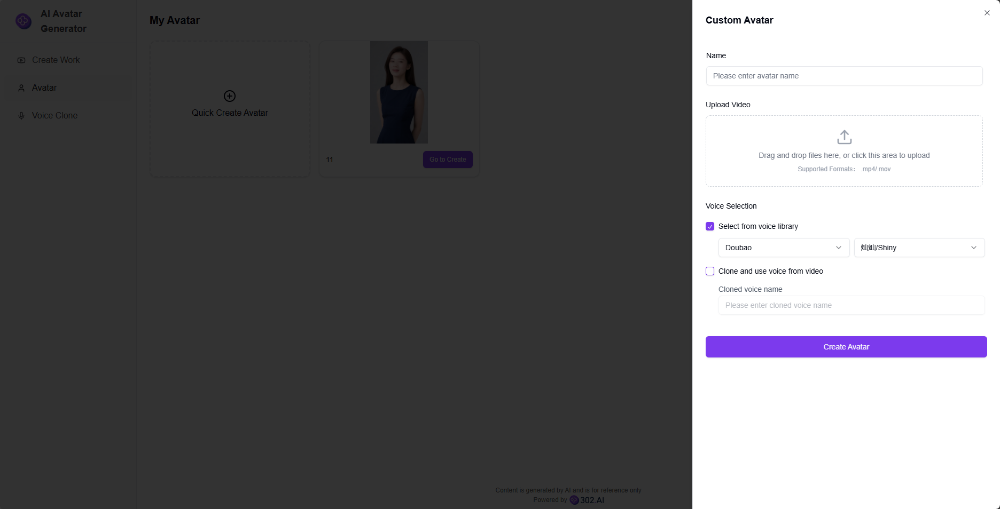
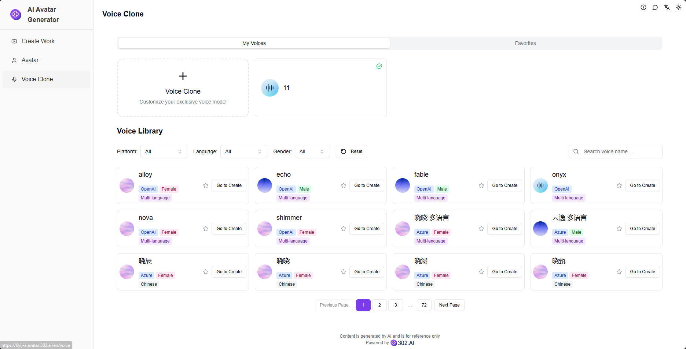

# <p align="center"> 🤖 AI Avatar Generator 🚀✨</p>

<p align="center">AI Avatar Generator generates digital human avatars through AI, supports multiple voice switching, and easily creates exclusive digital human video content for you.</p>

<p align="center"><a href="https://302.ai/product/detail/2151" target="blank"></a></p >

<p align="center"><a href="README_zh.md">中文</a> | <a href="README.md">English</a> | <a href="README_ja.md">日本語</a></p>



This is the open-source version of the [AI Avatar Generator](https://302.ai/product/detail/2151) from [302.AI](https://302.ai/en/). You can directly log in to 302.AI to use the online version with zero code and zero background, or modify and deploy it yourself according to your requirements.

## Interface Preview
The homepage displays all digital human synthesis works. Click "Create Work" to select a model and start creating. Currently we provide multiple digital human synthesis models: Chanjing, Hedra, OmniHuman, TopView, StableAvatar, Latentsync


Digital human work synthesis has two modes: text-driven and audio-driven, providing background replacement, text preview and other functions, while supporting batch generation of multiple works.
           

Text-to-avatar generation can create digital human avatars with one click through AI, and can also create actions for digital human avatars to generate video materials.
        

Custom digital humans can create exclusive digital humans by uploading video files.
    

Voice cloning function supports multiple AI voice cloning models, and customizes your exclusive voice with one click. Integrates high-quality voice libraries from multiple platforms, providing rich voice choices.
    

## Project Features
### 🎭 Multi-model Digital Human Synthesis
Supports multiple digital human synthesis models, including Chanjing, Hedra, OmniHuman, TopView, StableAvatar, Latentsync, etc.
### 🎥 Dual Drive Mode
- Text-driven: Input text to automatically generate digital human videos
- Audio-driven: Upload audio to generate corresponding digital human videos
### 🎨 Background Customization
Supports background replacement function, freely switch video background scenes.
### 🔊 Text Preview
Provides text-to-speech preview function, supports listening to effects.
### 📦 Batch Generation
Supports batch creation of multiple digital human works, improving creative efficiency.
### 🤖 AI Generated Digital Humans
Generate digital human avatars with one click through AI, supports avatar creation and action creation.
### 👤 Custom Digital Humans
Supports uploading video files to create exclusive digital human avatars.
### 🎙️ Voice Cloning
Supports multiple AI voice cloning models, integrates high-quality voice libraries from multiple platforms.
### 🌍 Multi-language Support
- Chinese Interface
- English Interface
- Japanese Interface

## 🚩 Future Update Plans
- [ ] Add more digital human model choices
- [ ] Add video editing and post-processing functions
- [ ] Support more voice choices

## 🛠️ Tech Stack

- **Framework**: Next.js 14
- **Language**: TypeScript
- **Styling**: TailwindCSS
- **UI Components**: Radix UI
- **State Management**: Jotai
- **Form Handling**: React Hook Form
- **HTTP Client**: ky
- **i18n**: next-intl
- **Theming**: next-themes
- **Code Standards**: ESLint, Prettier
- **Commit Standards**: Husky, Commitlint

## Development & Deployment
1. Clone the project
```bash
git clone https://github.com/302ai/302_ai_avatar_generator
cd 302_ai_avatar_generator
```

2. Install dependencies
```bash
pnpm install
```

3. Configure environment
```bash
cp .env.example .env.local
```
Modify the environment variables in `.env.local` as needed.

4. Start development server
```bash
pnpm dev
```

5. Build for production
```bash
pnpm build
pnpm start
```

## ✨ About 302.AI ✨
[302.AI](https://302.ai/en/) is an enterprise-oriented AI application platform that offers pay-as-you-go services, ready-to-use solutions, and an open-source ecosystem.✨
1. 🧠 Comprehensive AI capabilities: Incorporates the latest in language, image, audio, and video models from leading AI brands.
2. 🚀 Advanced application development: We build genuine AI products, not just simple chatbots.
3. 💰 No monthly fees: All features are pay-per-use, fully accessible, ensuring low entry barriers with high potential.
4. 🛠 Powerful admin dashboard: Designed for teams and SMEs - managed by one, used by many.
5. 🔗 API access for all AI features: All tools are open-source and customizable (in progress).
6. 💡 Powerful development team: Launching 2-3 new applications weekly with daily product updates. Interested developers are welcome to contact us.
