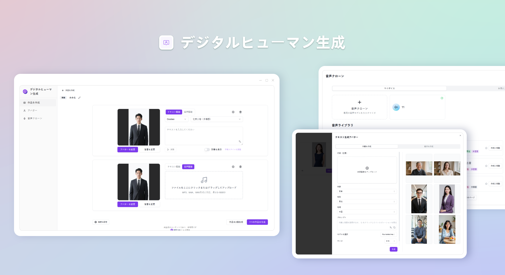
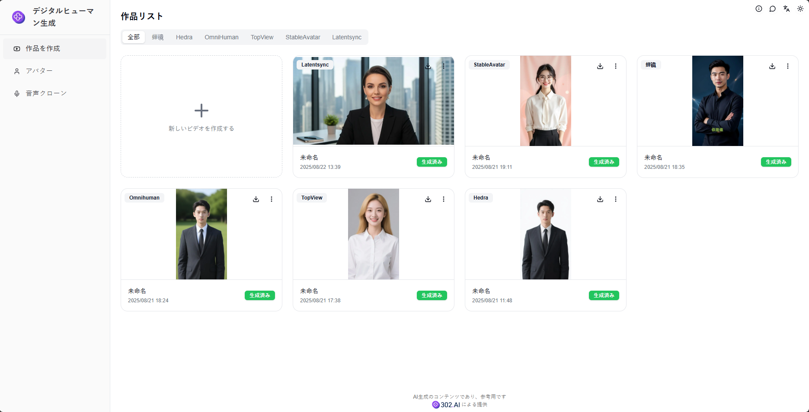
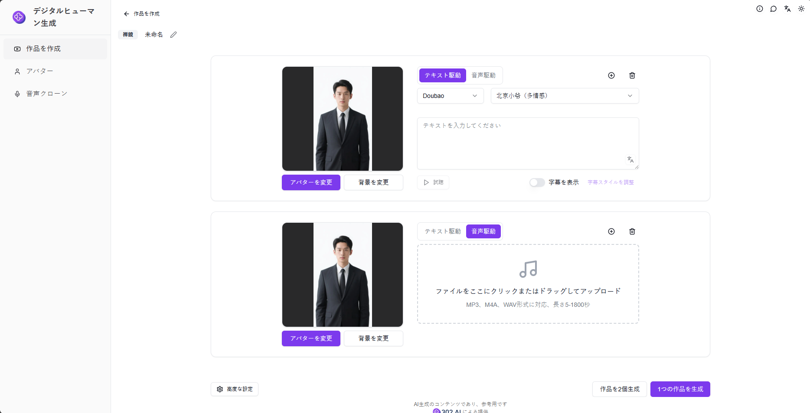
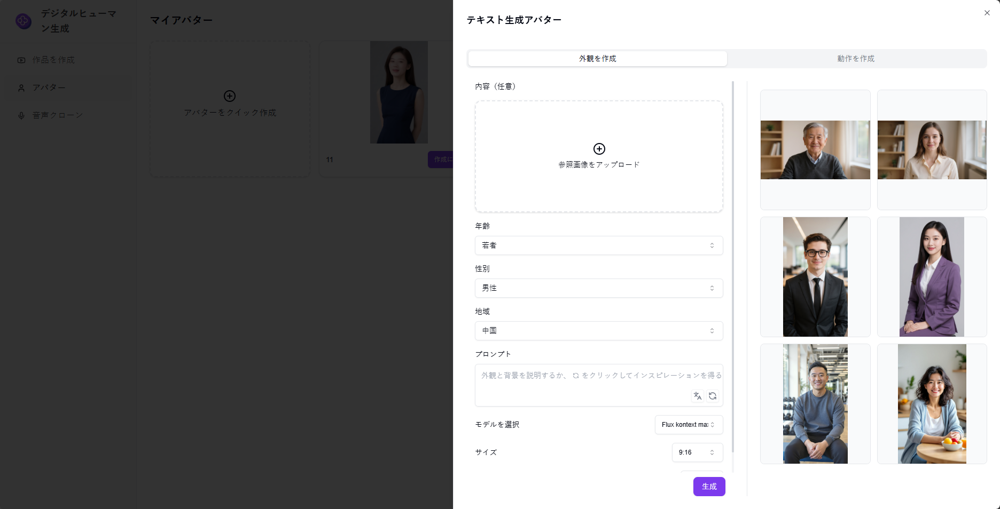
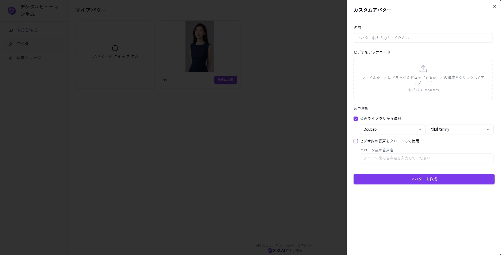
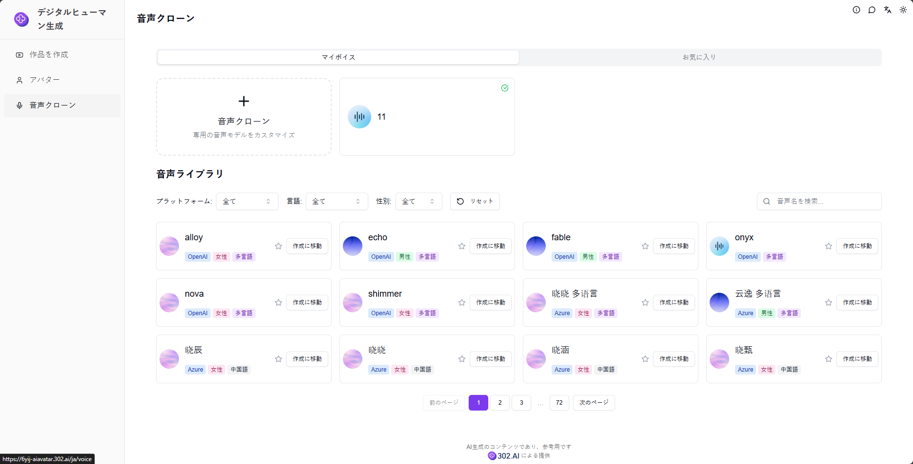

# <p align="center"> 🤖 デジタルヒューマン生成 🚀✨</p>

<p align="center">デジタルヒューマン生成はAIによってデジタルヒューマンアバターを生成し、複数の音色の自由な切り替えをサポートし、あなた専用のデジタルヒューマン動画を簡単に作成します。</p>

<p align="center"><a href="https://302.ai/product/detail/2151" target="blank"></a></p >

<p align="center"><a href="README_zh.md">中文</a> | <a href="README.md">English</a> | <a href="README_ja.md">日本語</a></p>



[302.AI](https://302.ai/ja/)の[デジタルヒューマン生成](https://302.ai/product/detail/2151)のオープンソース版です。
302.AIに直接ログインすることで、コード不要、設定不要のオンライン体験が可能です。
あるいは、このプロジェクトをニーズに合わせてカスタマイズし、302.AIのAPI KEYを統合して、自身でデプロイすることもできます。

## インターフェースプレビュー
ホームページではすべてのデジタルヒューマン合成作品を表示し、作品作成をクリックするとモデルを選択して制作を開始できます。現在、私たちは複数のデジタルヒューマン合成モデルを提供しています：蝉镜、Hedra、OmniHuman、TopView、StableAvatar、Latentsync


デジタルヒューマン作品の合成にはテキスト駆動とオーディオ駆動の2つのモードがあり、背景変更、テキスト試聴などの機能を提供し、同時に複数の作品の一括生成をサポートしています。
           

テキストからデジタルヒューマンはAIによってワンクリックでデジタルヒューマンの外観を生成し、デジタルヒューマンの外観に対してアクション作成を行い、動画素材を生成することもできます。
        

カスタムデジタルヒューマンは動画ファイルをアップロードすることで専用のデジタルヒューマンを作成できます。
    

音声クローン機能では、複数のAI音声クローンモデルをサポートし、ワンクリックであなた専用の音声をカスタマイズできます。複数プラットフォームの高品質音色ライブラリを統合し、豊富な音声選択を提供します。
                

## プロジェクトの特徴
### 🎭 マルチモデルデジタルヒューマン合成
複数のデジタルヒューマン合成モデルをサポートし、蝉镜、Hedra、OmniHuman、TopView、StableAvatar、Latentsyncなどが含まれます。
### 🎥 デュアル駆動モード
- テキスト駆動：テキストを入力してデジタルヒューマン動画を自動生成
- オーディオ駆動：オーディオをアップロードして対応するデジタルヒューマン動画を生成
### 🎨 背景カスタマイズ
背景変更機能をサポートし、動画の背景シーンを自由に切り替えできます。
### 🔊 テキスト試聴
テキスト読み上げプレビュー機能を提供し、効果の試聴をサポートします。
### 📦 一括生成
複数のデジタルヒューマン作品の一括作成をサポートし、制作効率を向上させます。
### 🤖 AI生成デジタルヒューマン
AIによってワンクリックでデジタルヒューマンの外観を生成し、外観作成とアクション作成をサポートします。
### 👤 カスタムデジタルヒューマン
動画ファイルのアップロードによって専用のデジタルヒューマン外観を作成することをサポートします。
### 🎙️ 音声クローン
複数のAI音声クローンモデルをサポートし、複数プラットフォームの高品質音色ライブラリを統合します。
### 🌍 多言語サポート
- 中国語インターフェース
- 英語インターフェース
- 日本語インターフェース

## 🚩 将来のアップデート計画
- [ ] より多くのデジタルヒューマンモデル選択を追加
- [ ] 動画編集と後処理機能を追加
- [ ] より多くの音色選択をサポート

## 🛠️ 技術スタック

- **フレームワーク**: Next.js 14
- **言語**: TypeScript
- **スタイリング**: TailwindCSS
- **UIコンポーネント**: Radix UI
- **状態管理**: Jotai
- **フォーム処理**: React Hook Form
- **HTTPクライアント**: ky
- **国際化**: next-intl
- **テーマ**: next-themes
- **コード規約**: ESLint, Prettier
- **コミット規約**: Husky, Commitlint

## 開発&デプロイ
1. プロジェクトのクローン
```bash
git clone https://github.com/302ai/302_ai_avatar_generator
cd 302_ai_avatar_generator
```

2. 依存関係のインストール
```bash
pnpm install
```

3. 環境設定
```bash
cp .env.example .env.local
```
必要に応じて`.env.local`の環境変数を修正してください。

4. 開発サーバーの起動
```bash
pnpm dev
```

5. プロダクションビルド
```bash
pnpm build
pnpm start
```

## ✨ 302.AIについて ✨
[302.AI](https://302.ai/ja/)は企業向けのAIアプリケーションプラットフォームであり、必要に応じて支払い、すぐに使用できるオープンソースのエコシステムです。✨
1. 🧠 包括的なAI機能：主要AIブランドの最新の言語、画像、音声、ビデオモデルを統合。
2. 🚀 高度なアプリケーション開発：単なるシンプルなチャットボットではなく、本格的なAI製品を構築。
3. 💰 月額料金なし：すべての機能が従量制で、完全にアクセス可能。低い参入障壁と高い可能性を確保。
4. 🛠 強力な管理ダッシュボード：チームやSME向けに設計 - 一人で管理し、多くの人が使用可能。
5. 🔗 すべてのAI機能へのAPIアクセス：すべてのツールはオープンソースでカスタマイズ可能（進行中）。
6. 💪 強力な開発チーム：大規模で高度なスキルを持つ開発者集団。毎週2-3の新しいアプリケーションをリリースし、毎日製品更新を行っています。才能ある開発者の参加を歓迎します。
