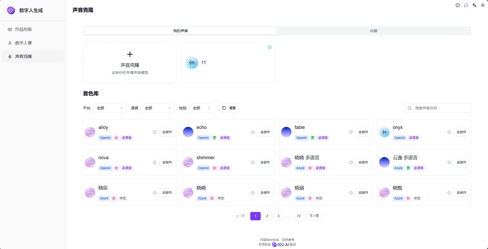

# <p align="center"> 🤖 数字人生成</p>

<p align="center">数字人生成通过AI生成数字人分身，支持多种音色自由切换，轻松打造专属于你的数字人口播视频。</p>

<p align="center"><a href="https://302.ai/product/detail/2151" target="blank"></a></p >

<p align="center"><a href="README_zh.md">中文</a> | <a href="README.md">English</a> | <a href="README_ja.md">日本語</a></p>


来自[302.AI](https://302.ai)的[数字人生成](https://302.ai/product/detail/2151)的开源版本。你可以直接登录302.AI，零代码零配置使用在线版本。或者对本项目根据自己的需求进行修改，传入302.AI的API KEY，自行部署。

## 界面预览
首页展示所有数字人合成的作品，点击创建作品即可选择模型开始创作。目前我们提供了多家数字人合成模型：蝉镜、Hedra、OmniHuman、TopView、StableAvatar、Latentsync


数字人作品合成有文本驱动和音频驱动两种模式，提供背景更换、文本试听等功能，同时支持批量生成多个作品。
           

文生数字人通过AI可一键生成数字人形象，还可对数字人形象进行动作创建，生成视频素材。
        

定制数字人通过上传视频文件即可创建专属的数字人。
    

声音克隆功能，支持多种AI声音克隆模型，一键定制你的专属声音。集成多平台优质音色库，提供丰富的声音选择。
    
 
 
## 项目特性
### 🎭 多模型数字人合成
支持多种数字人合成模型，包括蝉镜、Hedra、OmniHuman、TopView、StableAvatar、Latentsync等。
### 🎥 双驱动模式
- 文本驱动：输入文本自动生成数字人视频
- 音频驱动：上传音频生成对应数字人视频
### 🎨 背景自定义
支持背景更换功能，自由切换视频背景场景。
### 🔊 文本试听
提供文本转语音预览功能，支持试听效果。
### 📦 批量生成
支持批量创建多个数字人作品，提高创作效率。
### 🤖 AI生成数字人
通过AI一键生成数字人形象，支持形象创建和动作创建。
### 👤 定制数字人
支持上传视频文件创建专属数字人形象。
### 🎙️ 声音克隆
支持多种AI声音克隆模型，集成多平台优质音色库。
### 🌍 多语言支持
  - 中文界面
  - English Interface
  - 日本語インターフェース


## 🚩 未来更新计划
- [ ] 增加更多数字人模型选择
- [ ] 增加视频编辑和后处理功能
- [ ] 支持更多音色选择


## 🛠️ 技术栈

- **框架**: Next.js 14
- **语言**: TypeScript
- **样式**: TailwindCSS
- **UI组件**: Radix UI
- **状态管理**: Jotai
- **表单处理**: React Hook Form
- **HTTP客户端**: ky
- **国际化**: next-intl
- **主题**: next-themes
- **代码规范**: ESLint, Prettier
- **提交规范**: Husky, Commitlint

## 开发&部署
1. 克隆项目
```bash
git clone https://github.com/302ai/302_ai_avatar_generator
cd 302_ai_avatar_generator
```

2. 安装依赖
```bash
pnpm install
```

3. 环境配置
```bash
cp .env.example .env.local
```
根据需要修改 `.env.local` 中的环境变量。

4. 启动开发服务器
```bash
pnpm dev
```

5. 构建生产版本
```bash
pnpm build
pnpm start
```

## ✨ 302.AI介绍 ✨
[302.AI](https://302.ai)是一个按需付费的AI应用平台，为用户解决AI用于实践的最后一公里问题。
1. 🧠 集合了最新最全的AI能力和品牌，包括但不限于语言模型、图像模型、声音模型、视频模型。
2. 🚀 在基础模型上进行深度应用开发，我们开发真正的AI产品，而不是简单的对话机器人
3. 💰 零月费，所有功能按需付费，全面开放，做到真正的门槛低，上限高。
4. 🛠 功能强大的管理后台，面向团队和中小企业，一人管理，多人使用。
5. 🔗 所有AI能力均提供API接入，所有工具开源可自行定制（进行中）。
6. 💡 强大的开发团队，每周推出2-3个新应用，产品每日更新。有兴趣加入的开发者也欢迎联系我们
